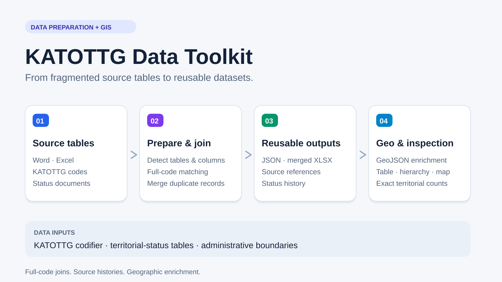

# KATOTTG Data Toolkit

**Working online version / Працююча версія:** [Open the service — Відкрити сервіс](https://ontonew.snman.science/katottg/index.html).

A browser-based toolkit for preparing Ukraine's administrative and territorial-status data from Word and Excel, exporting JSON and XLSX, and connecting the result to administrative boundaries in GeoJSON.

The main focus is **data preparation**: bringing fragmented source tables into a consistent structure with full KATOTTG codes, source references, status histories and an administrative hierarchy. A table, hierarchy and map viewer help inspect the prepared result.

**This repository contains software and documentation only.** Source documents, prepared datasets and geographic files are not distributed here. Supply your own inputs from the providers listed below. Local inputs and generated `data_files/` are excluded from Git.

The working service, **“ATU objects with occupation-status data,”** supports finding administrative objects and their identifiers, browsing subordinate objects, filtering by status, and viewing results as a table, hierarchy or map. The deployed service may run a different version from this repository.



This is an independent software project, not an official government registry. Source editions and attribution should accompany any dataset you prepare.

## What it does

- Accepts multiple `.docx`, `.xlsx` and `.xls` files in the same processing run.
- Finds Word tables and Excel worksheets and identifies columns by their headings and contents.
- Handles merged cells, multi-row headings and continuation tables.
- Identifies codifier tables and territorial-status orders by their contents.
- Joins records by the **full KATOTTG code** and merges duplicate source references.
- Preserves separate status periods and source histories, including ended periods.
- Exports `data.json`, a merged Excel workbook, enriched GeoJSON and a ZIP with a manifest.
- Uses JSON for geographic enrichment regardless of the selected download format.
- Calculates region, district and community summaries from level-4 records and shows exact affected/total counts.

## Input datasets and sources

| Input | Role | Source |
| --- | --- | --- |
| **KATOTTG codifier** | Administrative codes, names, categories and parent relationships | [Official codifier page](https://mininfra.gov.ua/diialnist/rozvytok-mistsevoho-samovriaduvannia/kodyfikator-administratyvno-terytorialnykh-odynyts-ta-terytorialnykh-hromad) |
| **Territorial-status documents** | Occupation/hostilities categories, start/end dates and information-system availability | [Order No. 376 and its editions](https://zakon.rada.gov.ua/laws/show/z0380-25) |
| **Administrative boundaries** | Geographic layers and joins to the prepared records | [HDX Ukraine COD-AB](https://data.humdata.org/dataset/cod-ab-ukr), referenced by the converter; review identifiers and attribution for your selected download |

The converter also links to geoBoundaries and Geofabrik / OpenStreetMap as alternative geographic sources. Their formats and identifiers can require adaptation. A link to a provider does not establish the provenance or licence of a user's uploaded file.

See [input formats and source tracking](docs/DATA_SOURCES.md) and [the preparation pipeline](docs/DATA_PIPELINE.md).

## Start with the preparation tool

Open `tools/prepare_data.html` directly in your browser, or serve this directory:

```sh
python -m http.server 8765 --bind 127.0.0.1
```

Then open <http://127.0.0.1:8765/tools/prepare_data.html>.

Keep the complete `tools` directory together. Its modules and browser libraries are local, so Word/Excel conversion works offline. Legacy Word `.doc` files must first be saved as `.docx`.

1. Add your codifier and status documents. Both upload fields identify table contents automatically.
2. Review the detected tables, column assignments, skipped rows and source references.
3. Export JSON, the merged workbook or both. Without a codifier, the output contains only territories present in the status documents.
4. Add compatible GeoJSON and enrich it using the generated JSON.
5. Download the package. Record source URLs, editions and geographic attribution with it.

Excel contains four worksheets: prepared KATOTTG records, merged orders, status history, and sources / detected columns. Codes and dates are exported as text.

## Load your data into the viewer

Create `data_files/` in the project root and copy your generated files there. Serve the project over HTTP and open <http://127.0.0.1:8765/>. The viewer loads:

| Local path | Purpose |
| --- | --- |
| `data_files/data.json` | Required prepared record array from the converter |
| `data_files/manifest.json` | Optional package metadata; `updated_at` in `YYYY-MM-DD` format provides the displayed update date |
| `data_files/ukr_admin1.geojson` through `ukr_admin4.geojson` | Geographic layers for regions, districts, communities and settlements |
| `data_files/admin4_by_oblast/*.json` | Optional generated settlement chunks for geographic lookup |

Each prepared record includes `katottg`, `admin_level`, `name`, `parent_katottg`, administrative location names, category, status, registry availability, dates and source history. Use the converter's output rather than constructing records from short display identifiers. Geographic files require compatible join fields; review the enrichment report after import.

Table and hierarchy views work with prepared JSON. Map features need your geographic files. The viewer also uses online interface resources and map tiles.

Upper-level filters use three mutually exclusive groups: full control, mixed, and all level-4 records affected by occupation or hostilities. A mixed territory has both controlled and affected records. Level-4 city districts are counted as city districts when supplied. The URL preserves the view, location, query, filters and open card; a card can copy that link.

## Tests

Node.js 20 or newer is sufficient; no package installation or dataset download is needed:

```sh
npm test
```

The default checks use **fictional generated records**. They cover converter normalization and workbook exports, full-code matching, status histories, parent summaries, disjoint filters, hierarchy navigation, same-name communities, address restoration, map-style decisions and CSV summaries. Registry checks use a small DOM substitute and do not replace visual browser review.

The optional `npm run test:converter` browser integration test requires Playwright and local Word fixtures in `internal files/`. Those documents are not distributed. See [converter documentation](tools/README.md).

## Project structure

```text
index.html                    Table, hierarchy, map and object cards
tools/prepare_data.html        Word/Excel and geographic preparation interface
tools/prepare_data_core.js     Import, normalization, merge and workbook export
tools/status_summary.js       Shared settlement-based parent summaries
tools/registry_url_state.js   Address-state parsing and serialization
tools/vendor/                 Local libraries and their licence notices
tools/tests/                  Source-only regression checks
docs/                         Source references, pipeline and presentation material
data_files/                   Your generated data — local, ignored by Git
```

## Attribution and licensing

Upstream libraries retain their licence notices in `tools/vendor/`. A project-wide licence for the custom code has not been selected. Public repository access does not replace dataset providers' terms. See [third-party notices](THIRD_PARTY_NOTICES.md).
