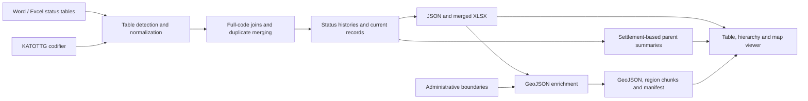

# From source documents to reusable data

## Detect and normalize

Word import reads tables from the document package and handles horizontal/vertical cell merges, repeated headings and table continuations. Excel import reads worksheets and merged ranges. Heading detection maps code, administrative names, category, status, dates and registry availability to a shared structure.

Files are identified by table contents rather than only by the upload field. A document may contain multiple useful tables alongside notes or cover sheets. The import report shows selected columns and skipped content. Legacy `.doc` documents must first be saved as `.docx`.

## Join and preserve history

The codifier supplies names, categories and parent codes. Orders are matched by full KATOTTG code. Missing parent codes are not invented when only status documents are available.

Duplicate orders are identified by code, status, start/end dates and registry availability. Their filename/table/row source references are combined. Separate time periods remain in the history. An ended period and an ongoing overlapping period are handled separately rather than treating the last row as the only fact.

## Calculate upper-level summaries

The shared summary module walks each level-4 record through its parent hierarchy. It counts four status categories: occupied, active hostilities, possible hostilities and under Ukrainian control.

Upper-level records fall into one of three groups:

- **Full control:** no affected level-4 records.
- **Mixed:** both affected and controlled level-4 records.
- **Fully affected:** every level-4 record is occupied or subject to a hostilities category.

The same summaries drive hierarchy cards, object cards, map-style decisions and upper-level filters. Counts remain based on the full territory when filters narrow the list of displayed territories. Kyiv and Sevastopol use the city-district records supplied at level 4.

The converter stores calculated summaries separately from source history. It preserves the original parent status in `source_status` and marks the calculation with `status_basis: settlements`.

## Export and connect geography

JSON is the shared input for geographic enrichment. Choosing an Excel download does not change that relationship. The workbook has prepared records, merged orders, histories and an import report with sources and detected columns.

The geographic module normalizes compatible administrative fields, connects geometry features to KATOTTG records, enriches properties and can create region-level settlement chunks. ZIP exports bundle results with a manifest. Matching by alternate field names requires review when a source's identifier scheme differs.

## Inspect the result

Search and filters expose the prepared dataset through table, hierarchy and map views. CSV exports follow the current result set. The URL preserves view, administrative location, query, filter mode, status, registries, level and open card, making a result reproducible for review.

The software runs in the browser. It does not upload imported Word/Excel documents to an application backend. The offline converter uses bundled libraries; the viewer also loads online interface resources and map tiles.
